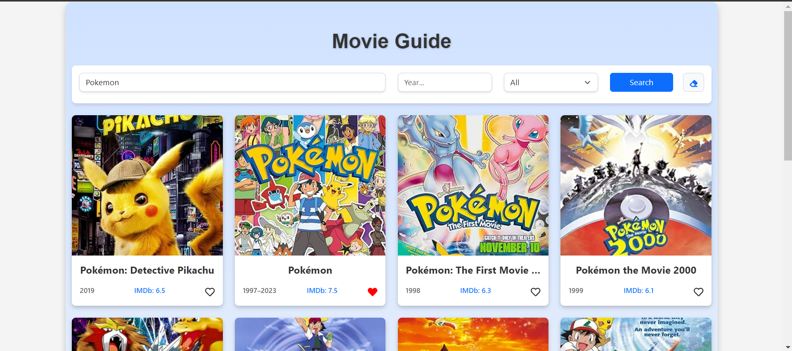
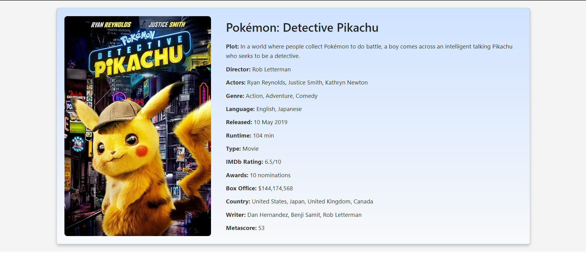

# Movie Guide

Movie Guide is a React application that allows users to search for movies, mark their favorites, and paginate through results. The application uses the OMDb API to provide movie information and features custom styles with SCSS to enhance user experience. Additionally, favorite movies are stored in local storage.

## Features

- **Movie Listing:** Movies are displayed in a grid format with name, release date, and IMDb ID.
- **Pagination:** Shows 10 movies per page.
- **Search:** Search for movies by name, with "Pokemon" as the default search term.
- **Year Filtering:** Users can list movies released in a specific year.
- **Type Selection:** Users can search for movies, TV series, or TV series episodes.
- **Movie Details:** Clicking on a movie redirects to a detail page showing information like poster, title, duration, genre, director, cast, IMDb rating, etc.
- **Favorites:** Users can add or remove movies from their favorites, which are stored in local storage. There is also a button to clear favorites.
- **Clear Filters:** A button is available to clear search and filter options.

## Technologies

- **React:** For building the user interface.
- **React-Bootstrap:** For UI components.
- **React Router:** For page navigation.
- **OMDb API:** For providing movie data.
- **SCSS:** For custom styling.
- **Local Storage:** For storing favorite movies.

## Installation

1. Clone the repository to your local machine:
    ```bash
    git clone https://github.com/elffbykll/movie-guide-react.git
    ```

2. Navigate to the project directory:
    ```bash
    cd movie-guide
    ```

3. Install the dependencies:
    ```bash
    npm install
    ```

4. Start the application:
    ```bash
    npm start
    ```

## Usage

- **Home Page:** When the application starts, it performs a default search for "Pokemon" and displays the results in a grid.
Search: Enter a movie name to perform a search.
- **Year and Type Filtering:** Use the filters next to the search box to narrow down your search by year and type.
- **Favorites:** Click on the heart icon to add or remove movies from favorites. Favorites are stored in local storage, and you can use the clear filters button to reset all filters.
- **Movie Details:** Clicking on a movie redirects you to a details page with information about the movie.
- **Pagination:** Use pagination buttons to navigate through search results.

## API Usage

This project uses the OMDb API to fetch movie data. You need to sign up on the OMDb API website to get an API key. Make sure to add your API key to the ./api/omdbApi.js file in the API_KEY variable.


